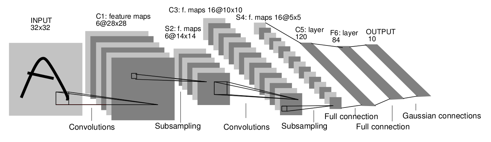



##神经网络算法

经典的神经网络算法在构造多层网络时，用梯度下降的方法，   
往往会在训练的过程中陷入到局部最小值难以跳出，   
而浅层结构又难以得到high level的特征
同时，如果简单的将图像作为一个像素vector来输入，又会忽略了图像本身邻近像素点的关联性   

1998年，Lecun提出了卷积神经网络的算法应用于书写体识别(*Gradient-Based Learning Applied to Document Recognition*)  
其模型结构大致如下：

